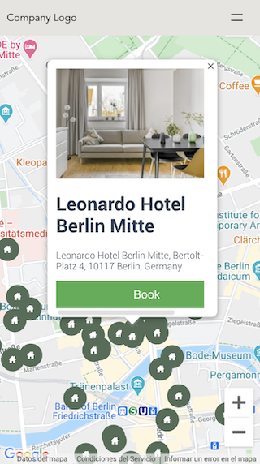

# Full-Stack Django/VueJS demo



## Summary
A full-stack web app demo with Django, VueJS and PostgreSQL containerized by Docker.

## Features
* Backend in GeoDjango and Django Rest Framework
* Frontend in Javascript and VueJS with Google Maps visualization
* PostgreSQL as a database with PostGis extension
* Containerized with Docker and docker-compose tools
* Populated data from [HERE Places API](https://developer.here.com/documentation/places/dev_guide/topics/quick-start-find-text-string.html)
* Easy setup with Makefile
* Basic unit testing

## 🚀 Quick start

For the use of this project it is recommended to use an operating system based in a Linux distribution or MacOS

```
$ make setup
$ make setup-data 
```

Wait a minute to run `make setup-data` because the above command may take too long to get up.

You can run the tests with the command:

```
$ make test
```
Note: you need previously run `make setup`

## Manual mode

In case you don't have docker installed, you can run the project manually

### Requirements
* PostgreSQL intalled
* Pipenv installed (https://pipenv.pypa.io/)
* nodejs / npm

```
$ git clone https://github.com/erikriver/fullstack-django-vuejs-demo.git
$ cd fullstack-django-vuejs-demo/backend
$ pipenv install
$ pipenv shell
```

```
$ python manage.py migrate
$ python manage.py loaddata project/fixtures/users.json
$ python manage.py get_places  # by default get hotels from Berlin, DE
$ python manage.py runserver
```

The instructions on how to run and build the frontend are in the `frontend` folder.

## ToDo
    * Authentication
    * Authorization
    * More tests